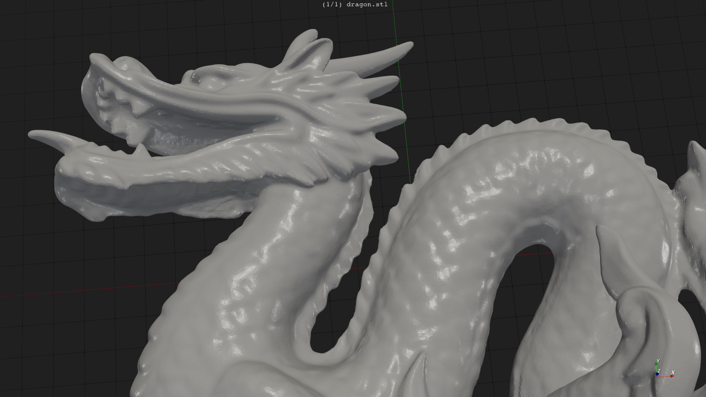
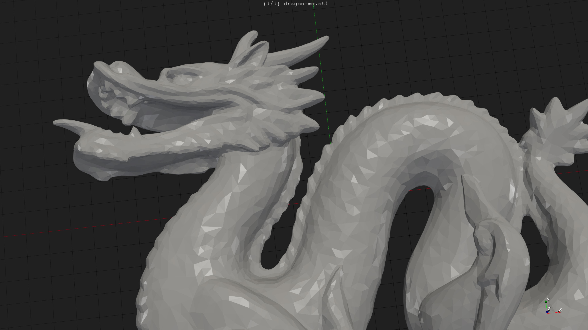

This repository contains heavily refactored code of [fTetWild project](https://github.com/wildmeshing/fTetWild).

The original readme document was renamed into `README.orig.md` in this repository.

My main goal was making a Windows DLL which implements a reliable surface mesh repair.

Other goals were improving performance and quality of that code.

Unlike the original, this project ain’t a research. I wanted to consume the library in a proprietary software. I wanted to comply with the license, that’s why publishing this project on github.

# Windows DLL

The complete API of the DLL is in the `MeshRepair/MeshRepair/API` subfolder of the repository.

The API surface is tiny: a single DLL entry point `createMeshRepair`, 3 COM interfaces, and a couple of helper structures.

I/O was out of scope of the library. 
A user is expected to supply a mesh as a pair of vertex/index buffers in system RAM, and the results are available as another pair of these buffers.

The API of the DLL was designed to be equally usable from C++ and C# programming languages.

# Performance

I’ve benchmarked on [Stanford dragon](https://en.wikipedia.org/wiki/Stanford_dragon) 3D model with default settings.

The computer I’m using at the time of writing has AMD [Ryzen 7 5700G](https://www.amd.com/en/products/apu/amd-ryzen-7-5700g) processor.

The original version took 4:51, process time 07:46 
My version 1.3.0 took 01:34 (about 3 times faster), process time 03:02

Despite I managed to make it way faster, I’m not quite happy with the performance. 
Just like the original version, this fork is mostly single-threaded. 
Only a few isolated pieces offload work to the thread pool. I’ve tried to parallelize at least the triangle insertion part, but failed, the incomplete support disabled with a preprocessor macro.

# Dependencies

The original version wa using complicated cmake scripts to download many dependencies from the internets.

Due to the smaller scope (no IO), I have dropped many of them, and copy-pasted most of the required ones into this repository, except one.

Here’s the list.

1. [Eigen 3.4.0](https://eigen.tuxfamily.org/index.php?title=Main_Page), MPL2 license. This repository includes many pieces from that library. 
Unmodified, configured vectorization with documented macros before including the headers.

2. [Geogram](https://github.com/BrunoLevy/geogram), BSD 3-Clause License. This repository included a small subset of the library. 
I have used their current master. 
Modified it heavily. 
That library resembles a framework, not a library.
This project only needs Delaunay tetrahedralization algorithm, and a few low-level geometric primitives. I have included these parts only.

3. [libigl 2.4.0](https://github.com/libigl/libigl), MPL2 license. This repository includes just a few small pieces. I have modified it to use OpenMP thread pool for parallelism.

4. [MPIR](https://github.com/BrianGladman/mpir) Due to the LGPL license of that one, I have not included that library into this repository. 
I have used current master version. 
The binaries on the Release page of this repo have AVX1 build of their `sandybridge` configuration.
The exact configuration not gonna affect performance because just a small fraction of the CPU time is spent calling functions from that DLL.
I have not made any changes to that library.
If you want to build it yourself, note you gonna need Python and also some `vyasm` software.

Dropped dependencies:

* TBB replaced with OpenMP supplied by the C++ compiler

* cli11 is no longer needed, the DLL doesn’t parse command lines

* fmt and spdlog, I didn’t like them. `std::vsnprintf` is good enougth for the job, and doesn’t inflate binary size expanding templates for every invocation.

* nlohmann/json, the DLL doesn’t read or write any files at all.

# Build Instructions

Build the MPIR somehow

The Visual Studio solution expects the headers in the following directory: `$(SolutionDir)..\..\mpir\sandybridge\Inc` 

And the static libraries are expected to be there, again relative to the `MeshRepair.sln` file: 
`$(SolutionDir)..\..\mpir\sandybridge\Bin` 
Note it needs both C and C++ versions, i.e. both `mpir.lib` and `mpirxx.lib` files.

Open `MeshRepair/MeshRepair.sln` solution with Visual Studio 2022 or newer. 
I have used the freeware community edition, version 17.3.5

Build the `RepairTest` project of that solution. 
This should produce `MeshRepair.dll` implementing the repair algorithm,
and `RepairTest.exe` which consumes that DLL to implement a stand alone mesh repair tool.
The tool only supports [binary STL](https://en.wikipedia.org/wiki/STL_%28file_format%29#Binary_STL) format of the models.

Copy `mpir.dll` into the output folder, and run the `RepairTest.exe` tool.

# Runtime Requirements

I only needed AVX2 build of this library. 
If you need AVX1 version, the downgrade going to be relatively easy. 
If you need an SSE only version, or ARM64 version, gonna be hard to downgrade, too many AVX intrinsics.

This project no longer uses cmake, but if you need a Linux version of this code, the port should be straightforward. 
The DLL doesn’t do any IO, doesn’t call any OS APIs directly, only uses OpenMP multithreading, and C++/17 standard library. 
For COM implementation the library uses [ComLightInterop](https://github.com/Const-me/ComLightInterop), which works fine on Linux.

If you don’t want to build anything only want to test, to run the released binaries you gonna need to install [vc_redist.x64.exe](https://aka.ms/vs/17/release/vc_redist.x64.exe)

# Screenshots

Source model, 871k faces, 41.5MB in binary STL format:

High precision result with relative epsilon = 1E-4. 
The test took 717 seconds = about 12 minutes on my computer, and generated 307k triangles, 14.6MB in binary STL format:

Medium precision result with relative epsilon = 1E-3. 
This one took 97 seconds to complete, and generated 28.4k faces, 1.35MB in binary STL format:

